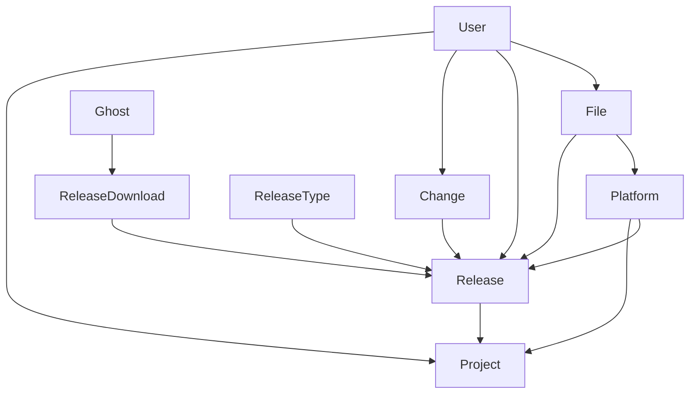

# APPS.BUBUKA.PRO

- [APPS.BUBUKA.PRO](#appsbubukapro)
  - [Базовое назначение](#базовое-назначение)
  - [Ссылка](#ссылка)
  - [Работа с сервисом](#работа-с-сервисом)
    - [Регистрация](#регистрация)
    - [Вход в систему](#вход-в-систему)
    - [Создание проекта](#создание-проекта)
    - [Добавление тугриков к релизу](#добавление-тугриков-к-релизу)
    - [Создание релиза](#создание-релиза)
    - [Информация о релизе](#информация-о-релизе)
    - [Скачивание релиза](#скачивание-релиза)
    - [Загрузка файла сборки релиза](#загрузка-файла-сборки-релиза)
    - [Общий просмотр доступных проектов и сборок](#общий-просмотр-доступных-проектов-и-сборок)
  - [Сущности сервиса](#сущности-сервиса)
    - [Пользователь \[User\]](#пользователь-user)
    - [Проект \[Project\]](#проект-project)
    - [Платформа \[Platform\]](#платформа-platform)
    - [Тугрики (Changelog item) \[Change\]](#тугрики-changelog-item-change)
    - [Файл \[File\]](#файл-file)
    - [Релиз \[Release\]](#релиз-release)
    - [Тип релиза \[ReleaseType\]](#тип-релиза-releasetype)
    - [Скачивание релиза \[ReleaseDownload\]](#скачивание-релиза-releasedownload)
    - [Призрак (Кто скачал) \[Ghost\]](#призрак-кто-скачал-ghost)
  - [Связи сущностей](#связи-сущностей)
  - [Эндпоинты API](#эндпоинты-api)
    - [Легенда](#легенда)
    - [Личный кабинет](#личный-кабинет)
  - [Используемый стек технологий](#используемый-стек-технологий)
  - [Статьи, Документы](#статьи-документы)

## Базовое назначение

- Единая точка загрузки\скачивания приложений проектов
- Описание изменений для релизов приложений - `тугрик`
- Хранение старых версий приложений
- Статистика скачиваний приложений
- Автоматическая публикация информации о новом релизе в социальные сети (?)

## Ссылка

[apps.bubuka.info](https://apps.bubuka.info)

## Работа с сервисом

### Регистрация

Регистрация пользователей производится из админки. Пользователь не может сам зарегистрироваться в системе.

Для регистрации пользователя требуется только `email` пользователя. Данные для входа в систему сгенерируются автоматически и отправятся на указанную почту.

### Вход в систему

Вход в систему стандартный: `email`, `password`.

### Создание проекта

Создание проектов производится только супер-админом. Обычные **пользователи не могут создать** свой **проект**.

После создания проекта необходимо:

- добавить в него платформы(типы устройств/ОС)
- пригласить пользователя. Без приглашения пользователь не сможет вносить информацию о релизах (Создавать релиз, изменять релиз).

### Добавление тугриков к релизу

Список изменений можно обновлять поэтапно либо пачкой при создании релиза.

Для добавления тугрика нужно **выбрать** **проект** и **платформу** релиза, после чего накидывать список тугриков(изменений). На этапе сбора\публикации релиза тугрики свяжутся с нужным релизом.

Список изменений можно будет отредактировать на этапе публикации релиза.

### Создание релиза

- Выбираем проект
- Выбираем платформу
- Накидываем\редактируем список тугриков по одному или пачкой
- Устанавливаем номер релиза
- Добавляем доп описание
- Добавляем технические теги к сборке для удобного поиска сборки при необходимости
- Загружаем файл
- Выбираем тип релиза (stable, prerelease, develope)
- Проверяем релиз на этапе предпросмотра
- Публикуем релиз.

После публикации релиза супер-админ или ПМ должен подтвердить релих. Без этого релиз не будет доступен к отображению на сайте и к скачиванию.

### Информация о релизе

Опубликованный и подтвержденный релиз будет доступен всем по ссылке: `/releases/{PROJECT}/{PLATFORM}/{TYPE}/{VERSION}/`

```text
/releases/bubuka/android/stable/latest/
/releases/bubuka/android/stable/2.0/
/releases/bubuka/limux/prerelease/latest/
/releases/bubuka/ios/develope/1.0/
```

На этой странице будет доступна информация о релизе:

- базовая информация о проекте, платформе
- описание релиза
- список изменений
- технические требования
- прочая информация о релизе
- ссылка на скачивание

### Скачивание релиза

Ссылка для скачивания файла релиза: `/download/{PROJECT}/{PLATFORM}/{TYPE}/{VERSION}/`

```text
/download/bubuka/android/stable/latest/
/download/bubuka_kz/android/stable/2.0/
/download/bubuka/limux/prerelease/latest/
/download/bubuka/ios/develope/1.0/
```

Каждое скачивание будет логироваться в системе.

Для логов будем брать информацию:

- ip
- useragent
- дата и время
- спец метки (utm)

### Загрузка файла сборки релиза

Файл сборки будет загружаться во время публикации релиза.

Структура каталогов будет в формате: `/{PROJECT}/{PLATFORM}/{TYPE}/{VERSION}.{EXT}`.
Пример: `/my-bubuka/windows/stable/3.5.msi`

Пользователь по итогу будет получать файл с названием `{PROJECT}_{PLATFORM}_{TYPE}_v{VERSION}.{EXT}`.
Пример: `my-bubuka_windows_stable_v3.5.msi`

### Общий просмотр доступных проектов и сборок

Публичный каталог для просмотра всех версий релизов и проектов.

Возможно в виде дерева, возможно в каком-то другом.

В каталоге не будут отображаться версии и проекты, которые были отмечены тегом `Приватно`

## Сущности сервиса

### Пользователь [User]

Сущность пользователя, который будет заниматься публикацией релизов и добавлением тугриков в к нему.

### Проект [Project]

Сущность проекта, в который будет публиковаться релиз.

### Платформа [Platform]

Сущность платформы. Для определения типа платформы релиза.

### Тугрики (Changelog item) [Change]

Сущность тугрика. Информация об изменении. Для прикрепления к релизу.

### Файл [File]

Сущность файла сборки. Для прикрепления к релизу.

### Релиз [Release]

Сущность релиза. Релиз приложения.

### Тип релиза [ReleaseType]

Сущность типа релиза. Стадия, этап релиза. 

Возможные значения:

- `planning`
- `pre-alpha`
- `alpha`
- `beta`
- `production`/`stable`
- `mature`
- `inactive`

или:

- `stable`
- `prerelease`
- `develope`

**Этот список необходимо согласовать с командой.**

### Скачивание релиза [ReleaseDownload]

Сущность лога скачивания релиза

### Призрак (Кто скачал) [Ghost]

Сущность пользователя, который скачал релиз.

## Связи сущностей



## Эндпоинты API

### Легенда

`FA` - Для администратора

`FU` - Для авторизированного пользователя

`FAU` - Для администратора или авторизированного пользователя

`P` - Публично

### Личный кабинет

- [x] Пользователь
  - [x] Авторизация `P`
  - [x] ДеАвторизация `FAU`
  - [x] Восстановление пароля `P`
  - [x] Регистрация `FA`
  - [x] Получить информацию о пользователе
  - [x] Refresh token
  - [x] Удаление аккаунта
- [x] Проект
  - [x] Добавить проект `FA`
  - [x] Получить данные о проекте
  - [x] Получить все данные о проектах
  - [x] Изменить проект `FA`
  - [x] Удалить проект `FA`
  - [x] Добавить платформу к проекту `FA`
  - [x] Удалить платформу у проекта `FA`
  - [x] Добавить пользователя к проекту `FA`
  - [x] Удалить пользователя у проекта `FA`
- [x] Платформа
  - [x] Добавить платформу `FA`
  - [x] Получить данные о платформе
  - [x] Получить все данные о платформах
  - [x] Изменить платформу `FA`
  - [x] Удалить платформу `FA`
- [x] Стадии(Этапы) разработки
  - [x] Добавить этап `FA`
  - [x] Получить данные об этапе разработке
  - [x] Получить все данные об этапах разработки
  - [x] Изменить этап `FA`
  - [x] Удалить этап `FA`
- [x] Релизы
  - [x] Добавить релиз `FU`
  - [x] Получить данные релиза
  - [x] Получить все данные о релизах
  - [x] Удалить релиз `FU`
  - [x] Изменить релиз `FU`
  - [x] Опубликовать релиз `FA`
  - [x] Загрузка файла сборки релиза `FA`
- [x] Тугрики (Изменение в релизе)
  - [x] Добавить тугрик `FU`
  - [x] Изменить тугрик `FU`
  - [x] Удалить тугрик `FU`
- [x] Файлы
  - [x] Посмотреть метаданные файла
  - [x] Посмотреть метаданные всех файлов
  - [x] Скачать сборочный файл

## Регулярка для ссылок

```
(?:\/)(?<action>\w+)(?:\/)(?<project>\w+)(?:\/)(?<platform>\w+)(?:\/)(?<release_type>\w+)(?:\/)(?<version>[\w\d\.]+)(?:\/)?
```

## Используемый стек технологий

- [VueJS](https://vuejs.org/) `3.2+`
- [NestJS](https://nestjs.com/) `9.3+` or [Laravel](https://laravel.com/) `9+`
- [PostgreSQL](https://www.postgresql.org/) `14+`
- [Docker](https://docker.io) `latest`
- [Swagger](https://swagger.io/) - для документации

## Статьи, Документы

- [Стадии разработки программного обеспечения](https://ru.wikipedia.org/wiki/Стадии_разработки_программного_обеспечения)
